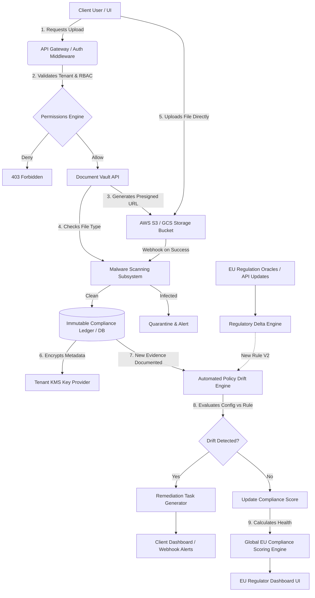

# EU Policy Compliance SaaS - System Architecture & Data Flow

## 1. High-Level Data Flow: Document Upload to Regulatory Drift

## 2. Core Architectural Components

### A. Identity & Gateway Layer
- **Router / API Gateway:** Entry point validating JWT, rate limits, and enforcing strictly partitioned routes (`/api/v1/tenant/:id/*`).
- **Permissions Engine (RBAC):** Checks the caller's role against the required policy (`tenant:upload_document`, `audit:read`).

### B. Secure Document Vault
- **Presigned URLs:** Clients upload directly to object storage via short-lived URLs.
- **Malware Webhook:** Object storage triggers an event queue to scan the file (e.g., ClamAV).
- **KMS Envelope Encryption:** Documents are encrypted at rest using symmetric keys specific to the tenant organisation; if the global DB leaks, files are inaccessible without the tenant-specific key.

### C. Regulatory Delta & Drift Engine
- **Oracles:** Cron jobs mapping external EU legislative updates into machine-readable `FrameworkRule` versions.
- **Drift Engine:** Compares a client's "current state" (documents uploaded, configurations applied, tasks open) against the "required state" dictated by the latest `FrameworkRule`.
- If a drift is identified (e.g., GDPR Art 28 sub-clause update requires a new specific DPIA format), the engine immediately spawns a `RemediationTask` with a `CRITICAL` severity constraint.

### D. Compliance Scoring System
- A deterministic rule-based engine. It aggregates open remediation tasks based on severity, expired policies, missing documentation artifacts, and time-to-remediate averages.
- Propagates an exact mathematical percentage downstream.

### E. Regulator Reporting / Ledger
- **Immutable Ledger:** Every mutation (drift identified, file uploaded, scoring tick) is logged with a cryptographic hash chain.
- Export pipeline streams this ledger into signed JSON-LD / PDF structures required by EU Member State auditors.
