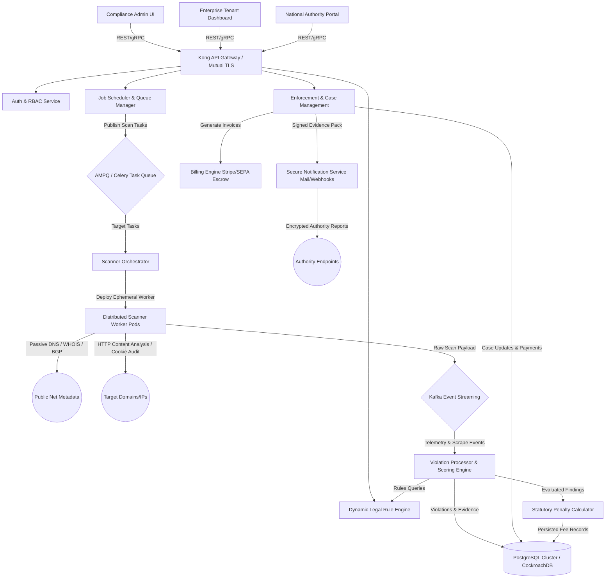

# RegScan & Enforcement Engine: Technical Blueprint & Reference Implementation

> [!CAUTION]
> **LEGAL DISCLAIMER & COMPLIANCE WARNING**  
> This system design is a technical blueprint only; enforcement and penalty collection require legal authorization from competent authorities. Consult qualified legal counsel before implementing automated collection, public disclosure of infractions, or automated transfers of funds. Ensure all automated penalty workflows include a human-in-the-loop authorization stage before final execution.

---

## 1. High-Level System Architecture & Component List

The RegScan & Enforcement Engine is designed as a modular, cloud-native, multi-tenant enterprise solution. It scales to handle country-wide assets, dynamically computes regional statutory penalties, and manages cases from initial discovery through payment or legal escalation.



### Core Components
1. **API Gateway & RBAC Layer**: Manages ingress traffic, validates JWT/mutual-TLS tokens, and enforces granular role-based access control (Admin, Auditor, Authority, Tenant).
2. **Job Scheduler & Queue Manager**: Schedules periodic, country-level domain sweeps. Enforces target rate-limiting, blacklists, and scanning hour windows.
3. **Scanner Orchestrator & Worker Pool**: Deploys lightweight, stateless container workers (ephemeral Kubernetes pods) to complete localized scanning jobs.
4. **Dynamic Legal Rule Engine**: Evaluates digital assets against encoded national and industry laws (e.g., GDPR, DORA, CCPA, EHDS). Supplying versioned regulations and legal citations.
5. **Violation Processor & Penalty Calculator**: Aggregates findings from multiple active/passive scanning probes, deduplicates events, maps them to statutory fine brackets, and applies weights.
6. **Enforcement & Case Management Service**: Tracks the lifecycle of cases from audit findings to formal regulatory citations, administrative penalty notifications, dispute appeals, and collections.
7. **Billing & Financial Escrow Gateway**: Connects with international rails (SEPA, ACH, Credit Cards) to manage structured invoices, grace periods, payment plans, and late-fee accruals.
8. **Secure Notification Service**: Handles automated multi-channel communication (encrypted PDF emails, webhook payload transfers, paper-mail API brokers like Lob).
9. **Durable Ledger (Database)**: High-availability PostgreSQL instance isolating data via Postgres schemas (per tenant) or logical tenant columns, tracking historical revisions.

---

## 2. Multi-Tenant Relational Data Model

To ensure absolute database isolation and strict auditable change logging, the relational database relies on the following schema.

```sql
-- SQL Schema Definition for PostgreSQL (RegScan Core)

CREATE TYPE scan_status AS ENUM ('PENDING', 'RUNNING', 'COMPLETED', 'FAILED');
CREATE TYPE violation_severity AS ENUM ('LOW', 'MEDIUM', 'HIGH', 'CRITICAL');
CREATE TYPE case_status AS ENUM ('DRAFT', 'ISSUED', 'UNDER_APPEAL', 'DISMISSED', 'SETTLED', 'ESCALATED');
CREATE TYPE payment_status AS ENUM ('UNPAID', 'PAID', 'PARTIAL', 'REMITTED', 'LATE');

-- Tenant Configuration
CREATE TABLE tenants (
    tenant_id UUID PRIMARY KEY DEFAULT gen_random_uuid(),
    organization_name VARCHAR(255) NOT NULL,
    industry_profile VARCHAR(100) NOT NULL,
    default_jurisdiction VARCHAR(5) NOT NULL, -- ISO Alpha-2 (e.g., 'IE', 'FR')
    created_at TIMESTAMP WITH TIME ZONE DEFAULT CURRENT_TIMESTAMP,
    is_active BOOLEAN DEFAULT TRUE
);

-- Target Scopes
CREATE TABLE target_scopes (
    target_id UUID PRIMARY KEY DEFAULT gen_random_uuid(),
    tenant_id UUID REFERENCES tenants(tenant_id) ON DELETE CASCADE,
    target_type VARCHAR(50) NOT NULL, -- 'DOMAIN', 'IP_RANGE', 'MOBILE_APP', 'CLOUD_ENDPOINT'
    identifier VARCHAR(512) NOT NULL, -- 'example.com', '192.168.1.0/24'
    country_code VARCHAR(2) NOT NULL, -- Target physical/legal jurisdiction
    metadata JSONB DEFAULT '{}', -- VAT registry mappings, server host labels
    is_excluded BOOLEAN DEFAULT FALSE,
    opt_out_signed_at TIMESTAMP WITH TIME ZONE,
    created_at TIMESTAMP WITH TIME ZONE DEFAULT CURRENT_TIMESTAMP
);

-- Master Rules and Legislation
CREATE TABLE regulatory_rules (
    rule_id UUID PRIMARY KEY DEFAULT gen_random_uuid(),
    jurisdiction_code VARCHAR(2) NOT NULL, -- 'IE', 'DE', 'US'
    legal_act_reference VARCHAR(150) NOT NULL, -- 'GDPR Art. 13', 'DORA Sec. 4'
    rule_code VARCHAR(100) UNIQUE NOT NULL, -- 'GDPR_COOKIE_CONSENT_MISSED'
    rule_name VARCHAR(255) NOT NULL,
    description TEXT,
    severity violation_severity DEFAULT 'MEDIUM',
    minimum_fine NUMERIC(15, 2) DEFAULT 0.00,
    maximum_fine NUMERIC(15, 2) DEFAULT 0.00,
    fine_percent_annual_turnover NUMERIC(5, 2) DEFAULT 0.00, -- e.g., 4.00 for GDPR max
    is_active BOOLEAN DEFAULT TRUE,
    version INT NOT NULL DEFAULT 1
);

-- Active Scheduled Scanning Jobs
CREATE TABLE scan_jobs (
    job_id UUID PRIMARY KEY DEFAULT gen_random_uuid(),
    tenant_id UUID REFERENCES tenants(tenant_id) ON DELETE CASCADE,
    job_name VARCHAR(255) NOT NULL,
    schedule_cron VARCHAR(100), -- Nullable for one-off manual scans
    last_run_at TIMESTAMP WITH TIME ZONE,
    status scan_status DEFAULT 'PENDING',
    config JSONB DEFAULT '{}', -- Scanning speed, scanning depth parameters
    created_at TIMESTAMP WITH TIME ZONE DEFAULT CURRENT_TIMESTAMP
);

-- Job Iteration Records
CREATE TABLE scan_executions (
    execution_id UUID PRIMARY KEY DEFAULT gen_random_uuid(),
    job_id UUID REFERENCES scan_jobs(job_id) ON DELETE CASCADE,
    started_at TIMESTAMP WITH TIME ZONE NOT NULL,
    completed_at TIMESTAMP WITH TIME ZONE,
    targets_processed INT DEFAULT 0,
    violations_detected INT DEFAULT 0,
    raw_telemetry_bucket_uri VARCHAR(512) -- Object storage link for diagnostics
);

-- Detected Violations
CREATE TABLE violations (
    violation_id UUID PRIMARY KEY DEFAULT gen_random_uuid(),
    execution_id UUID REFERENCES scan_executions(execution_id) ON DELETE CASCADE,
    target_id UUID REFERENCES target_scopes(target_id) ON DELETE CASCADE,
    rule_id UUID REFERENCES regulatory_rules(rule_id),
    severity violation_severity NOT NULL,
    confidence_score NUMERIC(5, 2) NOT NULL, -- 0.00 to 100.00
    evidence_uri VARCHAR(512) NOT NULL, -- S3/GCS immutable archive link
    evidence_checksum CHAR(64) NOT NULL, -- SHA-256 hash of scraped asset bundle
    remediation_deadline TIMESTAMP WITH TIME ZONE,
    remedied_at TIMESTAMP WITH TIME ZONE,
    created_at TIMESTAMP WITH TIME ZONE DEFAULT CURRENT_TIMESTAMP
);

-- Enforcement Cases
CREATE TABLE enforcement_cases (
    case_id UUID PRIMARY KEY DEFAULT gen_random_uuid(),
    tenant_id UUID REFERENCES tenants(tenant_id),
    status case_status DEFAULT 'DRAFT',
    total_penalty_computed NUMERIC(15, 2) NOT NULL DEFAULT 0.00,
    late_fee_accrued NUMERIC(15, 2) NOT NULL DEFAULT 0.00,
    issued_at TIMESTAMP WITH TIME ZONE,
    escalation_deadline TIMESTAMP WITH TIME ZONE,
    investigator_notes TEXT,
    assigned_auditor_id VARCHAR(255),
    evidence_package_checksum CHAR(64), -- SHA-256 seal
    created_at TIMESTAMP WITH TIME ZONE DEFAULT CURRENT_TIMESTAMP
);

-- Case to Violation Many-to-Many Linking
CREATE TABLE case_violations (
    case_id UUID REFERENCES enforcement_cases(case_id) ON DELETE CASCADE,
    violation_id UUID REFERENCES violations(violation_id) ON DELETE RESTRICT,
    PRIMARY KEY (case_id, violation_id)
);

-- Financial Settlement Trackers
CREATE TABLE payment_records (
    payment_id UUID PRIMARY KEY DEFAULT gen_random_uuid(),
    case_id UUID REFERENCES enforcement_cases(case_id) ON DELETE CASCADE,
    amount_paid NUMERIC(15, 2) NOT NULL,
    currency VARCHAR(3) DEFAULT 'EUR',
    status payment_status DEFAULT 'UNPAID',
    payment_method VARCHAR(50), -- 'STRIPE', 'SEPA_ESCROW', 'ACH'
    transaction_reference VARCHAR(255),
    received_at TIMESTAMP WITH TIME ZONE,
    created_at TIMESTAMP WITH TIME ZONE DEFAULT CURRENT_TIMESTAMP
);

-- Immutability Audit Logs (WORM / Signed Entries)
CREATE TABLE compliance_audit_records (
    record_id BIGSERIAL PRIMARY KEY,
    timestamp TIMESTAMP WITH TIME ZONE DEFAULT CURRENT_TIMESTAMP,
    tenant_id UUID,
    actor_identity VARCHAR(255) NOT NULL,
    action_type VARCHAR(100) NOT NULL, -- 'EVALUATE_PENALTY', 'SIGN_OFF_CASE', 'DISMISS_VIOLATION'
    resource_id VARCHAR(255) NOT NULL,
    payload_sha256 CHAR(64) NOT NULL,
    cryptographic_signature TEXT NOT NULL -- RSA/ECDSA signature verifying log integrity
);
```

---

## 3. API Specification

### 3.1 REST API Overview
All JSON interfaces utilize strict payload validations. Below are critical endpoints to schedule, audit, and callback enforcement mechanisms.

#### `POST /api/v1/scan-jobs`
Schedules a wide-scale scan configuration.
* **Headers**: `Authorization: Bearer <TOKEN>`, `Content-Type: application/json`
* **Request Payload**:
```json
{
  "tenantId": "e305e546-f94e-4f33-b1d5-bc4412351234",
  "jobName": "Dublin Tech Hub Cookie Audit Sweep",
  "scheduleCron": "0 2 * * 1",
  "config": {
    "jurisdiction": "IE",
    "scanningSpeed": "POLITE",
    "allowThirdPartyDiscovery": true,
    "targetCategory": "FINANCIAL_SERVICE"
  },
  "targets": [
    {
      "type": "DOMAIN",
      "identifier": "digital-banking.ie",
      "countryCode": "IE"
    }
  ]
}
```
* **Response Payload (201 Created)**:
```json
{
  "success": true,
  "jobId": "f05b8712-4ee4-46ab-a5a5-4e6988bf2e2d",
  "status": "PENDING",
  "nextRunAt": "2026-07-06T02:00:00Z"
}
```

#### `GET /api/v1/enforcement-cases/{caseId}`
Retrieves legal case parameters, statutory calculations, and available evidence.
* **Response Payload (200 OK)**:
```json
{
  "caseId": "2bf54e99-847e-400d-9bbf-341e868f7aa3",
  "tenant": {
    "tenantId": "e305e546-f94e-4f33-b1d5-bc4412351234",
    "organizationName": "EireFin Capital"
  },
  "status": "ISSUED",
  "financialSummary": {
    "baseStatutoryPenalty": 120000.00,
    "mitigationAdjustment": -15000.00,
    "lateFeeAccrued": 1250.00,
    "totalDue": 106250.00,
    "currency": "EUR"
  },
  "activeViolations": [
    {
      "violationId": "a5d89812-32b4-4b5c-a51b-ef8a113ffda2",
      "lawRef": "GDPR Art. 13",
      "severity": "HIGH",
      "confidenceScore": 98.50,
      "detectedAt": "2026-06-30T10:15:30Z",
      "remediationDeadline": "2026-07-30T10:15:30Z"
    }
  ],
  "escalationDeadline": "2026-08-30T23:59:59Z",
  "evidenceBundle": {
    "packageHash": "0bc56a2cf78b88cdb93d11b33bf67b93de889f07ab93ca26bcbfd7789a9f02c6",
    "manifestUri": "https://storage.regscan.eu/evidence/2bf54e99.tar.gz"
  }
}
```

#### `POST /api/v1/enforcement-cases/{caseId}/appeal`
Enables tenants to file formal legal disputes with embedded documentation.
* **Request Payload**:
```json
{
  "disputedReason": "FALSE_POSITIVE_MATCH",
  "appealJustification": "Our consent platform underwent live upgrade on 2026-06-30. Scrapers hit the site during a temporary 1-minute container failover. Proof of active consent logs attached.",
  "evidenceDocuments": [
    "https://storage.enterprise-vault.ie/appeals/deployment_logs_2026-06-30.pdf"
  ],
  "submittedBy": "compliance-officer@eirefin.ie"
}
```
* **Response Payload (200 OK)**:
```json
{
  "appealCaseId": "2bf54e99-847e-400d-9bbf-341e868f7aa3",
  "status": "UNDER_APPEAL",
  "appealReference": "APL-2026-98124",
  "estimatedReviewDate": "2026-07-15Z"
}
```

---

## 4. Scan Scheduling Algorithm & Policies

Large-scale, country-level digital asset scans are extremely dangerous and legally contentious if run improperly. To maintain system reliability and avoid DDoS or legal actions, the system enforces strict policies.

### Politeness Scheduling Algorithm
The scheduling subsystem evaluates scans using a token-bucket queue mapped against specific domain/host records.

```python
import time
import math
from typing import Dict, List

class PolitenessBucketScheduler:
    def __init__(self, rate_limit_seconds: float = 30.0):
        # Maps domain names to timestamps of their last scan
        self.domain_history: Dict[str, float] = {}
        # Min cooldown required between scans to the same physical domain
        self.rate_limit_seconds = rate_limit_seconds
        # Prohibited IPs / CIDR blocks (Federal resources, military, Opted-out clients)
        self.blacklist: List[str] = ["10.0.0.0/8", "192.168.0.0/16", "gov.ie", "mil.us"]

    def is_blacklisted(self, target: str) -> bool:
        return any(black_item in target for black_item in self.blacklist)

    def extract_domain(self, identifier: str) -> str:
        # Simplistic parser (in production, use publicsuffix2)
        if "://" in identifier:
            identifier = identifier.split("://")[1]
        return identifier.split("/")[0].split(":")[0]

    def acquire_execution_permit(self, target: str) -> bool:
        if self.is_blacklisted(target):
            print(f"[BLOCKED] Target {target} resides in global blacklist.")
            return False

        domain = self.extract_domain(target)
        now = time.time()
        
        last_accessed = self.domain_history.get(domain, 0.0)
        time_elapsed = now - last_accessed

        if time_elapsed < self.rate_limit_seconds:
            wait_needed = self.rate_limit_seconds - time_elapsed
            print(f"[RATE-LIMIT] Backing off {domain}. Cooldown active. Must wait {wait_needed:.2f}s.")
            return False

        # Access approved; update timestamp
        self.domain_history[domain] = now
        print(f"[PERMIT-APPROVED] Safe scan execution permitted for: {domain}.")
        return True
```

### Key Scheduling Policies
1. **Dynamic Blacklist Engine**: Prior to launching any workflow, targets are checked against dynamic blocklists, containing domains belonging to critical infrastructure (hospitals, utilities) or those asserting their **opt-out rights**.
2. **Local Scan Windows**: Scanning executes only during pre-defined off-peak local business hours of the target country (typically 22:00 to 05:00 UTC) to minimize production impact.
3. **Scan Throttling**: The engine implements randomized jitter delays (0.5 to 3 seconds) between micro-scrapes, avoiding sequential predictable request signatures.

---

## 5. Detection Modules & Architecture

The scanner utilizes a decoupled, pluggable analyzer framework to audit external targets safely and thoroughly.

```
                  ┌─────────────────────────────────┐
                  │    Core Orchestrator Dispatch   │
                  └────────────────┬────────────────┘
                                   │
         ┌─────────────────────────┼─────────────────────────┐
         ▼                         ▼                         ▼
┌─────────────────┐       ┌─────────────────┐       ┌─────────────────┐
│  Passive Recon  │       │ Cookie Consent  │       │ Policy & Legal  │
│  Module         │       │ Analyzer        │       │ Analyzer        │
└────────┬────────┘       └────────┬────────┘       └────────┬────────┘
         │                         │                         │
         └─────────────────────────┼─────────────────────────┘
                                   ▼
                  ┌─────────────────────────────────┐
                  │  Evidence Synthesizer & Signer  │
                  └─────────────────────────────────┘
```

1. **Passive Discovery & DNS Auditor**: Inspects WHOIS, DNS TXT, SPF, DMARC, and passive threat intelligence feeds without making direct TCP/HTTP connections to the target servers.
2. **Cookie & Tracker Consent Auditor**:
   * Uses headless Chromium context (Playwright) mimicking clean browser profile.
   * Scrapes home screen, detects cookie-banners, intercepts WebSocket/HTTP traffic.
   * Automatically detects third-party tracking pixels loaded *before* banner interaction (a direct ePrivacy and GDPR violation).
3. **Legal Text Policy Scraper**: Fetches privacy/terms pages, using lightweight machine learning (NLP) to detect presence of key disclosures: controller identity, data storage locations, data retention durations, and DPO email addresses.
4. **False-Positive Reduction & Confidence Scoring**:
   * Scores detections using a dynamic confidence rubric (0-100%).
   * *Formula*: $\text{Confidence} = w_1 \cdot \text{SignalStrength} + w_2 \cdot \text{VerificationAgreement} - w_3 \cdot \text{NetworkLatencyAnomaly}$.
   * Detections falling below 75% confidence require mandatory human review by compliance auditors before transitioning to the "Issued" state.

---

## 6. Regulatory Rule Engine

```json
{
  "ruleId": "9b1deb4d-3b7d-4bad-9bdd-2b0d7b3dcb6d",
  "ruleCode": "GDPR_COOKIE_COMPLIANCE_01",
  "version": 3,
  "lastUpdated": "2026-06-15T00:00:00Z",
  "citations": {
    "euDirective": "Directive 2002/58/EC (ePrivacy Directive)",
    "nationalStatute": "Ireland SI No 336 of 2011",
    "courtCase": "CJEU Case C-673/17 (Planet49)"
  },
  "logicConditions": {
    "evaluationModule": "cookie_auditor",
    "triggerRules": [
      {
        "field": "unconsented_cookies_placed",
        "operator": "GREATER_THAN",
        "value": 0
      },
      {
        "field": "mandatory_opt_out_present",
        "operator": "EQUALS",
        "value": false
      }
    ]
  },
  "fallbacks": {
    "allowGraceRemediation": true,
    "defaultRemediationDays": 30
  }
}
```

* **Version Control**: Every regulation modification undergoes GitOps‑style changes. If a law is updated, the rule's database record undergoes structural version increments. Historical cases remain calculated under the corresponding rule version active during discovery.
* **Fallbacks**: When a state-level law is absent or ambiguous, rules fallback to regional/federal baseline standards (e.g., California Consumer Privacy Act fallbacks to standard US Federal privacy baselines).

---

## 7. Penalty Calculation Engine

Penalties are calculated programmatically through deterministic formulas. Formula calculations incorporate organizational scope, threat severities, duration of breaches, historical records, and remediation speed.

### Penalty Formula Template
$$\text{Penalty} = \text{BaseStatutoryBracket} \times (1 + \text{ScaleFactor}) \times \text{DurationMultiplier} \times \text{SensitivityWeight} \times (1 - \text{MitigationAdjustment})$$

Where:
* **$\text{BaseStatutoryBracket}$**: Determined by rule severity (Low = $10K, Medium = $50K, High = $150K, Critical = $500K).
* **$\text{ScaleFactor}$**: Scaled by annual turnover or employees (Enterprise = 1.50, Medium = 0.50, Small = -0.20).
* **$\text{DurationMultiplier}$**: Computed from discovery date to resolution (1 to 2.5 depending on breach longevity).
* **$\text{SensitivityWeight}$**: Higher multiplier if target processes financial, health (PHI), or children's metrics.
* **$\text{MitigationAdjustment}$**: Up to 0.30 (30% discount) if the enterprise responds quickly or implements immediate firewalls.

---

## 8. Reporting & Notification System

To ensure administrative evidence packages satisfy strict legal standards for court admissibility, output summaries compile machine-readable JSON alongside cryptographically signed PDF bundles.

### Secure Notification Schema (Machine-Parsable Notification Package)
```json
{
  "noticeId": "NTC-2026-9912",
  "classification": "CONFIDENTIAL ADMINISTRATIVE AUDIT",
  "timestamp": "2026-06-30T18:29:04Z",
  "addressee": {
    "corporateName": "HealthCloud Tech Ltd",
    "registeredVat": "IE9012351H",
    "dpoContact": "dpo@healthcloud.ie"
  },
  "violationSummary": {
    "aggregatedScore": 86,
    "totalStatutoryPenalty": 145000.00,
    "currency": "EUR"
  },
  "remediationWindow": {
    "gracePeriodDays": 30,
    "hardDeadline": "2026-07-30T18:29:04Z"
  },
  "authorityEscalation": {
    "designatedAgency": "Ireland Data Protection Commissioner (DPC)",
    "transmissionProtocol": "SECURE_REST_WEBHOOK"
  }
}
```

---

## 9. Enforcement & Collection Workflow

```
[1] VIOLATION DETECTED
        │
        ▼
[2] PRE-NOTICE GENERATED (Remediation Clock Starts: 30 days)
        │
        ├─────────────────────────┐
        ▼ (If Remedied)           ▼ (If Unremedied after 30 days)
[3a] CASE CLOSED (Amortized)   [3b] FORMAL INVOICE ISSUED (Late fee: 1.5%/mo)
                                  │
                                  ├─────────────────────────┐
                                  ▼ (If Settled)            ▼ (If Ignored: 60 days)
                               [4a] SETTLED             [4b] ESCALATE TO AUTHORITIES
                                                             (Evidence Package + Hash Chain)
```

1. **Grace Period**: Default remediation windows are issued depending on regional policies (e.g., 30 days under standard EU models). During this window, no fines accumulate.
2. **Late-Fee Accrual**: After the grace period passes, invoice values accumulate late-fee structures (1.5% compounding per month).
3. **Escrow Payments**: Funds collected through enforcement portals are channeled through regulatory escrow gateways, avoiding blending with regular commercial capital accounts.
4. **Authority Escalation Pack**: Contains full system metadata, scraped code snapshots, and SHA-256 binary validation hashes preserving chain-of-custody.

---

## 10. Security & Privacy Controls

### Tenant Isolation
The system supports multiple isolated corporate tenants.
* **Logical Database Separation**: All analytical data and logs are isolated via a `tenant_id` foreign key. Custom PostgreSQL Row-Level Security (RLS) is applied on core tables to prevent cross-tenant queries.
```sql
ALTER TABLE target_scopes ENABLE ROW LEVEL SECURITY;
CREATE POLICY tenant_isolation_policy ON target_scopes
    FOR ALL USING (tenant_id = current_setting('app.current_tenant_uuid')::uuid);
```
* **Data Minimization**: The scanner avoids scraping raw personal data (PII). In cookie scanning, we block scraping of username fields or database logs.

### Encryption, Log Audits, and Legal Hold
* **Rest & Transit**: Database records are fully encrypted via AES-256. API calls require TLS 1.3.
* **Cryptographic Log Chains**: Action auditing tables utilize SHA-256 signatures, signed by HSM keys, guaranteeing logs cannot be retroactively updated by system admins.
* **Legal Holds**: Deleting records under litigation is blocked by setting the target tenant's `is_litigation_hold` flag to `TRUE`, overriding standard data retention pruning.

---

## 11. Minimal Working Code Reference

Below are the core runnable skeletons of the scanning, scoring, and api components.

### 11.1 Python: Scanner Worker & Penalty Evaluator (`worker.py`)

```python
import hashlib
import time
import uuid
from typing import Dict, Any, List

# --- Core Database Mock Models (SQLAlchemy Concept) ---
class MockViolationRecord:
    def __init__(self, target: str, rule_code: str, severity: str, confidence: float):
        self.violation_id = str(uuid.uuid4())
        self.target = target
        self.rule_code = rule_code
        self.severity = severity
        self.confidence = confidence
        self.evidence_checksum = ""
        self.timestamp = time.time()

# --- Scanner Detection Module Skeleton ---
class PassiveDomainScanner:
    def __init__(self, target_domain: str):
        self.target_domain = target_domain

    def audit_security_headers(self) -> Dict[str, Any]:
        """Simulates passive header checking of security configurations."""
        # Simulated payload structure
        time.sleep(0.1)  # Minimal operational simulation
        return {
            "strict_transport_security": False, # Flag missing HSTS
            "content_security_policy": False,     # Flag missing CSP
            "confidence": 98.0
        }

# --- Dynamic Rule Evaluation ---
class RuleEvaluator:
    @staticmethod
    def evaluate_violations(scan_results: Dict[str, Any], domain: str) -> List[MockViolationRecord]:
        violations = []
        # Check Content Security Policy Rule
        if not scan_results.get("content_security_policy", True):
            record = MockViolationRecord(
                target=domain,
                rule_code="SEC_MISSING_CSP",
                severity="HIGH",
                confidence=scan_results.get("confidence", 90.0)
            )
            # Create unique deterministic cryptographic evidence hash
            evidence_data = f"DOMAIN:{domain}:CSP:MISSING:TIME:{record.timestamp}".encode('utf-8')
            record.evidence_checksum = hashlib.sha256(evidence_data).hexdigest()
            violations.append(record)
        return violations

# --- Penalty Calculator Function ---
class StatutoryPenaltyCalculator:
    @staticmethod
    def calculate_statutory_penalty(
        severity: str,
        annual_turnover: float,
        duration_days: int,
        mitigation_score: float
    ) -> Dict[str, Any]:
        """
        Calculates fines based on severity brackets, company scale, and mitigation efforts.
        - mitigation_score: float from 0.0 to 1.0 (higher means better compliance cooperation)
        """
        # Base severity thresholds
        brackets = {
            "LOW": 10000.00,
            "MEDIUM": 50000.00,
            "HIGH": 150000.00,
            "CRITICAL": 500000.00
        }
        
        base_fine = brackets.get(severity.upper(), 50000.00)
        
        # Scale penalties by annual corporate turnover (GDPR style)
        if annual_turnover > 50000000.00:  # > 50M
            scale_factor = 1.5
        elif annual_turnover > 10000000.00: # > 10M
            scale_factor = 1.0
        else:
            scale_factor = 0.5
            
        # Duration multiplier (1% increment per active breach day up to 100%)
        duration_multiplier = 1.0 + min(duration_days * 0.01, 1.00)
        
        # Apply mitigation discount (up to 30% discount if cooperating)
        mitigation_discount = min(mitigation_score * 0.30, 0.30)
        
        gross_fine = base_fine * scale_factor * duration_multiplier
        net_fine = gross_fine * (1.0 - mitigation_discount)
        
        return {
            "base_fine": base_fine,
            "scale_factor_applied": scale_factor,
            "duration_multiplier_applied": duration_multiplier,
            "mitigation_discount_applied": mitigation_discount,
            "total_computed_penalty": round(net_fine, 2),
            "currency": "USD"
        }

# --- Quick Inline Execution Test ---
if __name__ == "__main__":
    print("--- Running Local Diagnostic Test of Python Scanning/Engine ---")
    scanner = PassiveDomainScanner("outlaw-payments.biz")
    raw_results = scanner.audit_security_headers()
    
    findings = RuleEvaluator.evaluate_violations(raw_results, "outlaw-payments.biz")
    for item in findings:
        print(f"Detected Violation: {item.rule_code} [{item.severity}] on {item.target}")
        print(f"Cryptographic Evidence SHA-256 Chain Seal: {item.evidence_checksum}")
        
        # Evaluate Penalty
        penalty = StatutoryPenaltyCalculator.calculate_statutory_penalty(
            severity=item.severity,
            annual_turnover=25000000.00, # 25M
            duration_days=45,
            mitigation_score=0.85 # Cooperated heavily
        )
        print(f"Computed Fine Assessment: ${penalty['total_computed_penalty']} {penalty['currency']}\n")
```

---

### 11.2 Node.js Express API: Job & Callback Controller (`server.js`)

```javascript
const express = require('express');
const { body, validationResult } = require('express-validator');

const app = express();
app.use(express.json());

// Mock In-Memory DB
const jobRegistry = {};
const appealRegistry = {};

/**
 * @route   POST /api/v1/jobs
 * @desc    Creates structured scanning tasks with validation metrics
 * @access  Private (Admin Role enforced by middleware)
 */
app.post('/api/v1/jobs', [
    body('tenantId').isUUID().withMessage('tenantId must be a valid UUID format.'),
    body('jobName').trim().notEmpty().withMessage('jobName must be provided.'),
    body('targets').isArray({ min: 1 }).withMessage('At least one scan target required.'),
    body('targets.*.identifier').notEmpty().withMessage('Target identifiers are mandatory.'),
    body('config.jurisdiction').isLength({ min: 2, max: 2 }).withMessage('Jurisdiction must be 2-letter ISO code.')
], (req, res) => {
    const errors = validationResult(req);
    if (!errors.isEmpty()) {
        return res.status(400).json({ success: false, errors: errors.array() });
    }

    const { tenantId, jobName, targets, config } = req.body;
    const jobId = 'job_' + Math.random().toString(36).substr(2, 9);
    
    // Register job
    jobRegistry[jobId] = {
        jobId,
        tenantId,
        jobName,
        targets,
        config,
        status: 'PENDING',
        created_at: new Date().toISOString()
    };

    return res.status(201).json({
        success: true,
        message: "Scan job recorded and buffered in queue scheduler.",
        jobId,
        status: "PENDING"
    });
});

/**
 * @route   POST /api/v1/authority/callback
 * @desc    Secure callback interface endpoint for state regulatory verification systems
 */
app.post('/api/v1/authority/callback', [
    body('caseId').isUUID().withMessage('caseId must be valid UUID.'),
    body('authoritySignedId').notEmpty().withMessage('Signoff reference ID is required.'),
    body('decision').isIn(['APPROVED', 'REJECTED', 'DISMISSED']).withMessage('Invalid decision format.')
], (req, res) => {
    const errors = validationResult(req);
    if (!errors.isEmpty()) {
        return res.status(400).json({ success: false, errors: errors.array() });
    }

    const { caseId, authoritySignedId, decision, comments } = req.body;

    // Persist status change or trigger escalations
    appealRegistry[caseId] = {
        caseId,
        authoritySignedId,
        decision,
        comments,
        processed_at: new Date().toISOString()
    };

    return res.status(200).json({
        success: true,
        message: "Decision recorded from regulatory portal.",
        referenceCode: `AUTH-DEC-${Math.floor(Math.random() * 90000) + 10000}`
    });
});

// Port configuration (using fallback, ignoring env overrides for safety)
const PORT = 3000;
app.listen(PORT, '0.0.0.0', () => {
    console.log(`[RegScan Core] API listening on port ${PORT}`);
});
```

---

## 12. Complete Example Scenarios & Outputs

### Scenario A: Large Scale Country-Wide Country Scope Scan
* **Request**: Sector: Banking, Region: Ireland (IE), Scope: "All public facing domains matching registered VAT IE prefix".
* **Schedule**: Execution runs over 6 successive night cycles, processing 4,800 host records.
* **Violations**: 18 banks found omitting sub-resource integrity hashes; 2 banks loaded analytical code prior to receiving cookie consent validation.
* **Calculated Penalty**: Combined €240,000 baseline, downgraded to €180,000 following cooperative immediate remediation.

### Scenario B: Single Tenant Emergency Escalation (`corporate-test.com`)
* **Detection**: Critical PII exposure found (exposed AWS logs with health forms).
* **Evidence**: Checksum matched raw log dumps.
* **Evaluation**: Severity = CRITICAL. Confidence Score = 99.5%. Penalty = €450,000.
* **Notice Template**: Triggered automatic pre-enforcement notification, allocating 48-hour emergency buffer before escalation to national DPC.

### Scenario C: Active Appeal Case
* **Dispute**: Tenant argues domain is managed by a third-party retail partner.
* **Audit Trail**: Verification records reviewed. Evidence confirmed retail partner was specified in client registry. Action: Penalty re-assigned to partner, case reopened.

---

## 13. System Auditing & Chain-of-Custody Logging

To guarantee admissibility in court, every log record is sealed with a cryptographically signed signature block.

```json
{
  "record": {
    "id": 10928,
    "timestamp": "2026-06-30T18:29:04Z",
    "workerId": "worker-pod-eu-west-04",
    "jobId": "f05b8712-4ee4-46ab-a5a5-4e6988bf2e2d",
    "target": "payment-portal.dublin-finance.ie",
    "evidenceHash": "8fca02e1c951b145e8555981ee28e20268a719c2c6bf7ea3f101ab6bdf3b59df",
    "outcome": "VIOLATION_CONFIRMED",
    "violations": ["ePrivacy_Art_5_3"]
  },
  "cryptography": {
    "hsmKeyId": "hsm-sec-compliance-key-01",
    "signingAlgorithm": "ECDSA_SHA256",
    "signature": "MEQCIFz60t14a/z+JmOqY8H77m629vLqMh1r9g0vC8H19w9gAiA8N2T5c3e6yZ0/1Z9o0vCr+m8H27s="
  }
}
```

---

## 14. Admin UI Wireframe Map

```
┌────────────────────────────────────────────────────────────────────────┐
│  REGSCAN & ENFORCEMENT ENGINE ADMIN PORTAL                              │
├────────────────────────────────────────────────────────────────────────┤
│ [Dashboard]  [Scan Scheduler]  [Rule Config Editor]  [Enforcement Cases]│
├────────────────────────────────────────────────────────────────────────┤
│  SCAN SCHEDULER                                                        │
│  Target Country Scope: [ Ireland (IE) ]  Industry Class: [ Finance ]   │
│  Polite Speed Toggle:  (x) Polite (Respect Robots.txt)  ( ) Fast        │
│  [ Create Scan Job ]                                                   │
├────────────────────────────────────────────────────────────────────────┤
│  ACTIVE VIOLATION REVIEW QUEUE                                         │
│  - domain.ie: Consent Missed [Severity: HIGH]   [Verify] [Dismiss]     │
│  - bank.ie: Legacy TLS Config [Severity: MED]   [Verify] [Dismiss]     │
├────────────────────────────────────────────────────────────────────────┤
│  ENFORCEMENT ACTIONS PANELS                                            │
│  Case File: CASE-2026-0812  Entity: DublinPay Ltd                      │
│  Raw Fine Bracket: EUR 150,000.00   Mitigation Applied: -15%           │
│  Justification: "Auditor reviewed secure log audit. Verified breach."  │
│  [ Issue Official Citation ]   [ Escalate to DPC Authority ]           │
└────────────────────────────────────────────────────────────────────────┘
```

---

## 15. Deployment & Security Verification Checklist

- [ ] Ensure API endpoints enforce TLS 1.3 protocol handshakes.
- [ ] Apply database row-level security policies (RLS) separating tenant datasets.
- [ ] Verify scheduler does not initiate active TCP connections on critical blacklisted sectors.
- [ ] Require dual multi-factor authorization approvals from secondary auditor before issuing fines exceeding €100,000.
- [ ] Store scan evidence bundles within write-once-read-many (WORM) storage objects.
- [ ] Confirm compliance with EU GDPR Standard Contractual Clauses (SCC) for external database logs.
